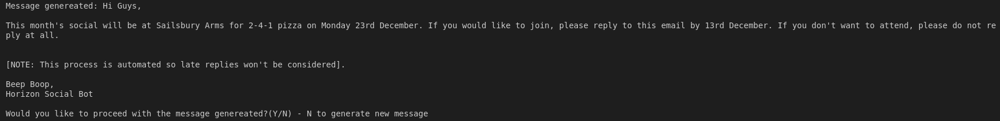

# Social_Bot

**Description**

Python script to generate and send an email organizing a monthly social event.

Activities are selected at random from a hard-coded list of Cambdridge(UK) based activities with an associated day of the week e.g. 50% off Mondays. The first instance of that day after a hard-coded pay day is then selected.

An email invitaion is assembled and send using the smtplib python library. Responses can then by tallied by entering 'Tally' when prompted and the relevent functions will be called, using the Pyzmail and IMAPclient libraies to canvas responces to the invitation.

**Requirments**
- Python Version 3.11+
- The libraries from requiements.txt installed
- A gmail account with app access enambled
- An app password to access the gmail account - See Google documentation for more info: https://support.google.com/accounts/answer/185833?hl=en

- The following enviroment varibales must be set:

|Variable|Description|
|--------|-----------|
|USERNAME|The username of the gmail account from which invitations will be sent
|APP_PASSWORD|The app password of the gmail account from which invitations will be sent|
|RECIPIENT_LIST|A space seperated list of email addresses for the invitation to be sent too|

**Instructions for Use**

On running social_bot.py you will receive the following message:

To create a new invitation enter 'Create'. The program will then print an invitation it has generated and ask if you would like to proceed with this message or generate a new one:

You can enter 'N' as many times as you like and the program will continue to generate new messages but selecting only from a list of five activities.
Enter 'Y' to send the given message to all of the addresses in the recipient list.

To tally the number of responces the invitation from the current month. enter 'Tally' a message with the number of respondants will be printed:

